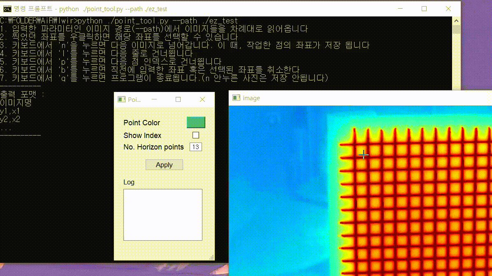

# Point_tool
Create, modify, and delete points where you want them to be in the picture, and save the coordinates of those points in txt form.


## Demo
<p align="center"></p>

## How to use
Required Module (Recommand using anaconda)
- PyQT5
- python-opencv
- argparse
```
python ./point_tool.py --path {folder directory}
```
The txt file is saved in the folder where the executable is located by the name of the date and time format.


## Development Environment
* Windows 10
* Python
* Visual Studio Code

## Referenced. Thank you all
code : https://github.com/brotherwook/Make_AIDataset/blob/master/6.%20%EC%9E%A1%EB%8B%A4%ED%95%9C%EA%B1%B0/mouseclick.py
