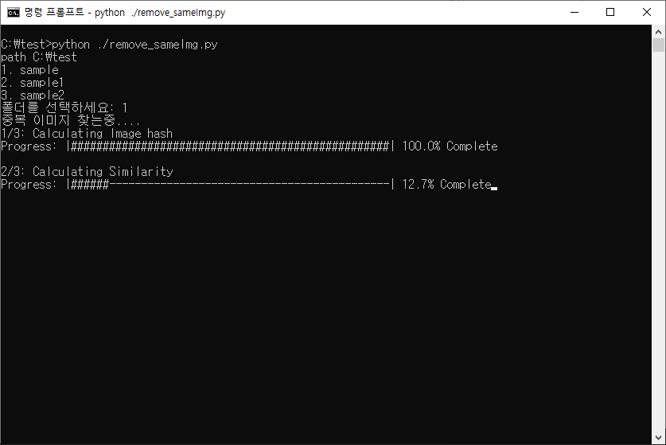
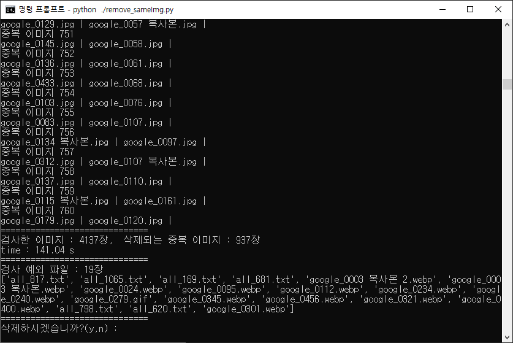
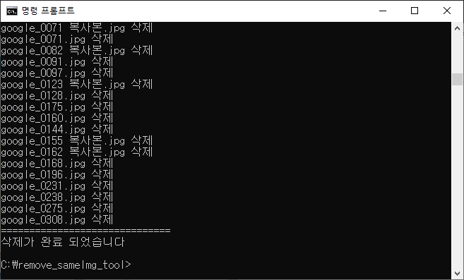

# Remove_same_img_tool
Find and delete similar or identical image files(jpg, png)


## How to use
Required Module (Recommand using anaconda)
- python-opencv
- PIL
- numpy

#### 1. The Python file must be in the same location as the folder containing the image you are working with.
#### 2. It can only be used for 'jpg' and 'png' format images.
#### 3. ```python ./remove_sameImg.py```





## Development Environment
* Windows 10
* Python
* Visual Studio Code
